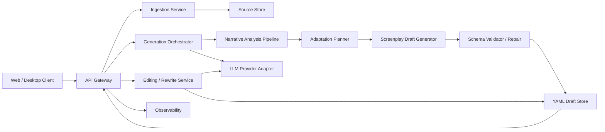
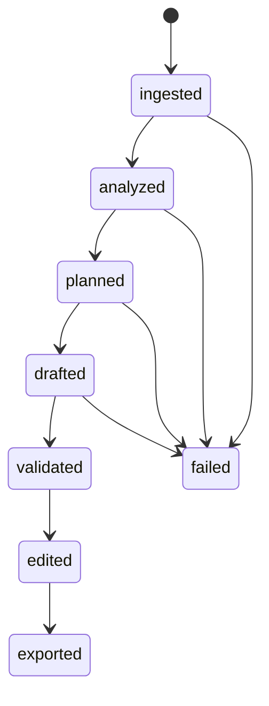

# AI 小说转剧本工具技术架构方案

## 1. 架构目标

本方案服务于一个“文档型 AI 生产系统”：

- 输入是多章节小说文本
- 中间态是结构化理解结果和改编规划结果
- 输出是可校验、可编辑、可追溯的 YAML 剧本

架构设计优先级如下：

1. 结构稳定性高于一次生成华丽程度
2. 可追溯性高于黑盒生成速度
3. 可局部重生成高于一次性长输出
4. 可校验和可恢复高于单次模型成功率

## 2. 总体架构

## 3. 核心组件

### 3.1 Client

职责：

- 提交作品和章节文本
- 配置改编参数
- 展示 YAML 和结构化编辑视图
- 发起局部重生成

建议：

- 首版可用 Web 客户端
- YAML 编辑和表单编辑并存

### 3.2 API Gateway

职责：

- 身份鉴权
- 任务路由
- 参数校验
- 返回统一响应结构

建议接口风格：

- `POST /adaptation-jobs`
- `GET /adaptation-jobs/:id`
- `GET /adaptation-jobs/:id/draft`
- `POST /adaptation-jobs/:id/regenerate-scene`
- `PATCH /drafts/:id`

### 3.3 Ingestion Service

职责：

- 校验作品基础信息
- 校验章节数和连续性
- 做文本规范化
- 切分章节、段落和候选事件片段

输入：

- 作品标题
- 作者名
- 章节列表
- 改编参数

输出：

- 标准化任务对象
- 原文快照
- 章节索引

### 3.4 Narrative Analysis Pipeline

职责：

- 人物识别
- 地点识别
- 关键事件提取
- 冲突和情绪转折提取
- 章节摘要与因果链构建

建议输出对象：

- `character_candidates`
- `location_candidates`
- `event_beats`
- `chapter_summaries`
- `risk_flags`

实现建议：

- 不直接让主模型一次吃完全部上下文并产出终稿
- 先做分析，再做规划，再做剧本生成

### 3.5 Adaptation Planner

职责：

- 决定保留哪些主线
- 决定哪些叙述转成动作或对白
- 决定事件合并、删减和桥接
- 控制目标场景数和节奏密度

建议输出对象：

- `adaptation_strategy`
- `scene_plan`
- `kept_threads`
- `merged_events`
- `added_bridges`

### 3.6 Screenplay Draft Generator

职责：

- 按 scene plan 逐场生成结构化草稿
- 输出严格遵循 Schema 的对象树
- 生成最终 YAML

建议生成方式：

- 先输出 JSON object
- 校验成功后再序列化为 YAML

原因：

- JSON 更容易约束结构
- YAML 更适合最终展示和人工编辑

### 3.7 Schema Validator / Repair

职责：

- 使用正式 JSON Schema 校验输出
- 捕获缺字段、错类型、非法枚举值
- 在安全范围内做自动修复
- 修复失败时向上返回结构错误

建议：

- 使用 `ajv` 等校验器
- 把修复逻辑限制在结构层，不要静默篡改剧情语义

### 3.8 Editing / Rewrite Service

职责：

- 处理用户手工编辑保存
- 按场景、内容块或角色进行局部重生成
- 保持稳定 ID 和版本链

关键原则：

- 局部重生成不能破坏其他场景
- 局部重生成必须保留 `source_refs`
- 人工修改优先级高于机器默认输出

## 4. 数据模型

### 4.1 核心实体

- `Work`
- `AdaptationJob`
- `SourceChapter`
- `NarrativeAnalysis`
- `AdaptationPlan`
- `ScreenplayDraft`
- `DraftRevision`

### 4.2 建议表结构

#### `works`

- `id`
- `user_id`
- `title`
- `author_name`
- `language`
- `created_at`

#### `adaptation_jobs`

- `id`
- `work_id`
- `status`
- `target_format`
- `adaptation_mode`
- `target_duration_minutes`
- `error_code`
- `error_message`
- `created_at`
- `updated_at`

#### `source_chapters`

- `id`
- `job_id`
- `chapter_number`
- `chapter_title`
- `raw_text`
- `normalized_text`
- `word_count`

#### `narrative_analyses`

- `id`
- `job_id`
- `analysis_json`
- `created_at`

#### `adaptation_plans`

- `id`
- `job_id`
- `plan_json`
- `created_at`

#### `screenplay_drafts`

- `id`
- `job_id`
- `schema_version`
- `draft_json`
- `draft_yaml`
- `validation_status`
- `created_at`
- `updated_at`

#### `draft_revisions`

- `id`
- `draft_id`
- `revision_number`
- `change_type`
- `editor_type`
- `change_payload`
- `created_at`

## 5. 状态机

状态说明：

- `ingested`：输入已接收并标准化
- `analyzed`：叙事分析完成
- `planned`：改编规划完成
- `drafted`：初稿已生成
- `validated`：通过 Schema 校验
- `edited`：已有人工修改
- `exported`：已导出到下游格式
- `failed`：在任一阶段失败

## 6. 关键流程

### 6.1 首次生成流程

1. Client 提交章节文本和参数
2. API Gateway 创建 adaptation job
3. Ingestion Service 校验章节数量和连续性
4. Narrative Analysis Pipeline 生成结构化理解
5. Adaptation Planner 产出 scene plan
6. Draft Generator 按场景生成 JSON 草稿
7. Validator 校验 JSON 是否满足 Schema
8. 校验通过后转为 YAML 并持久化
9. Client 获取 YAML 和结构化视图

### 6.2 局部重生成流程

1. 用户选中某个场景或内容块
2. Editing Service 提取局部上下文
3. 构造受限 prompt 和局部结构约束
4. 模型仅返回该局部对象
5. Validator 校验局部更新是否合法
6. 合并到当前 draft revision

## 7. LLM 集成策略

### 7.1 为什么不用“一次性生成整份 YAML”

- 长上下文下结构更容易漂移
- 角色、地点命名一致性更难保证
- 一旦某处结构损坏，整份结果都不可用

### 7.2 推荐链路

1. 分析模型：提取人物、地点、事件、冲突
2. 规划模型：生成 scene plan
3. 生成模型：按 scene plan 逐场生成结构对象
4. 修复模型：仅在结构校验失败时做最小修复

### 7.3 Prompt 约束建议

- 明确输出必须遵循固定字段
- 要求保留来源章节引用
- 要求区分原著内容和桥接内容
- 当信息不确定时填入 `open_questions`

## 8. 校验与一致性策略

### 8.1 结构校验

- 基于 [screenplay.schema.json](D:/Code/VSCode_Project/Prose2Play/schemas/screenplay.schema.json) 做严格校验
- 禁止未知字段混入
- 枚举值必须合法

### 8.2 跨字段业务校验

以下内容不完全适合放进纯 JSON Schema，需要应用层补充：

- 章节号必须连续
- `chapter_range` 必须覆盖 `chapters`
- 场次编号必须严格递增
- `cast` 中角色 ID 必须实际存在
- `location_id` 必须实际存在
- `added_bridges` 与场景 `adaptation_notes` 要保持一致

### 8.3 语义一致性检查

- 角色名称和别名冲突检查
- 人物首次出场前引用检查
- 同一场景的时间和地点冲突检查
- 同一事件跨场重复或遗漏检查

## 9. 存储策略

### 9.1 建议存储双轨制

- `draft_json`：程序处理主版本
- `draft_yaml`：作者阅读编辑版本

原因：

- JSON 更适合内部处理、比对和局部更新
- YAML 更适合最终展示和导出

### 9.2 原文存储

- 原小说原文应加密存储
- 支持按任务、作品、租户隔离
- 支持软删除和彻底删除

## 10. 安全设计

### 10.1 输入安全

- 限制单次上传体积
- 对富文本或上传文件做清洗
- 不信任客户端传来的章节连续性判断

### 10.2 数据安全

- 原文和草稿隔离存储
- 所有对象绑定 `user_id` / `tenant_id`
- 敏感操作记录审计日志

### 10.3 模型安全

- 避免把其他用户作品拼接进同一推理上下文
- 明确提供“不用于训练”的产品策略
- 对违规内容保留审核和拒绝能力

## 11. 可观测性

### 11.1 指标

- 任务创建数
- 首次生成成功率
- 平均生成耗时
- Schema 校验失败率
- 自动修复成功率
- 局部重生成使用率
- 人工编辑保留率

### 11.2 日志

- 每阶段输入输出摘要
- 校验失败详情
- 模型调用耗时和 token 消耗
- 场景数量和桥接比例

### 11.3 告警

- 校验失败率异常升高
- 某模型版本输出结构漂移
- 生成耗时显著上升

## 12. 技术选型建议

### 12.1 后端

- Node.js + TypeScript
- Fastify 或 NestJS
- Zod 做请求校验
- Ajv 做 JSON Schema 校验

### 12.2 数据层

- PostgreSQL 存元数据和版本信息
- Object Storage 存原文快照和 YAML 文件

### 12.3 前端

- Next.js
- 结构化表单视图 + YAML 编辑视图双模式

### 12.4 异步任务

- Queue: BullMQ / Cloud Tasks / SQS
- 适合把分析、规划、生成拆成后台任务

## 13. 演进路线

### v1

- 单任务生成
- YAML 初稿输出
- 严格结构校验
- 基础编辑与保存

### v1.5

- 局部重生成
- 多策略版本对比
- 更强的语义一致性检查

### v2

- 分集结构
- 导出器
- 协作审校
- 节奏分析和商业标签分析

## 14. 实施建议

### Sprint 1

- 完成 Schema、数据库模型、任务状态机
- 完成章节导入和基础校验

### Sprint 2

- 完成分析、规划、生成三段式链路
- 完成 YAML 持久化和返回接口

### Sprint 3

- 完成局部编辑、局部重生成和 revision 记录
- 完成监控与错误恢复

### Sprint 4

- 进行多题材样本评估
- 调优 prompt、校验和修复策略
